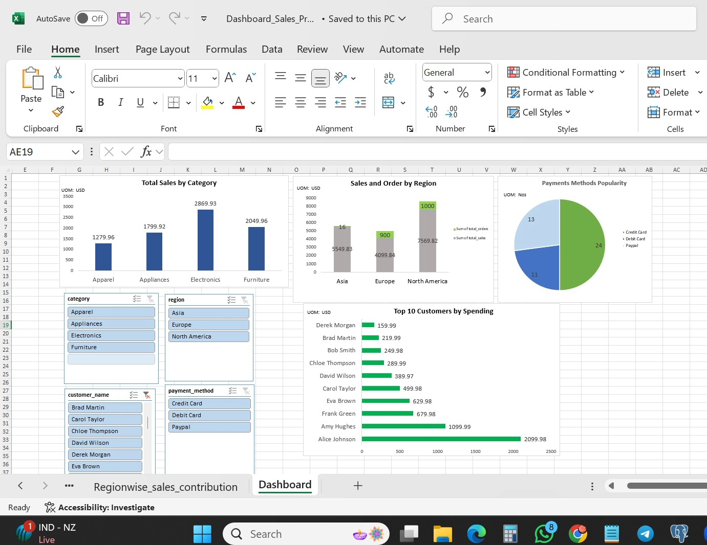

# Sales Dashboard Project

## Project Overview
This project demonstrates the application of SQL in building a sales data analysis pipeline. Starting from scratch, we designed a structured database using SQL to store and manage sales data, enabling efficient querying and analysis. Using SQL’s powerful data manipulation and aggregation capabilities, we transformed raw data into meaningful insights. Finally, we brought these insights into an interactive Excel dashboard to visualize patterns and trends across various aspects, such as customer behavior, product performance, and sales growth.

This project highlights several SQL concepts, including:

- **Database Design**: Defining relational tables and setting up primary and foreign keys to maintain data integrity.
- **Data Insertion** and Population: Using INSERT statements to populate tables with sample data.
- **Data Filtering and Aggregation**: Leveraging SQL queries with GROUP BY, JOIN, and filtering clauses to gather insights from the data.
Complex Queries: Combining multiple tables through JOIN operations to analyze customer orders, product categories, and regional sales, allowing us to dive deep into sales trends and customer behavior.

## Project Objectives
1. **Database Creation**: Designed SQL tables to store customer, product, and sales data.
2. **Data Insertion and Analysis**: Used SQL queries to generate insights on sales trends, customer activity, and regional performance.
3. **Dashboard in Excel**: Visualized data insights with an interactive Excel dashboard using PivotTables and slicers.

## Project Workflow
### 1. Database Creation in SQL
   - **Tables Created**:
     - `Customers`: Contains customer details.
     - `Products`: Product information including categories and prices.
     - `Orders`: Stores order details, linking customers with products.
     - `Sales`: Detailed sales records, including payment methods and quantities.
   - **Sample Data Insertions**: Added sample data for a realistic simulation of sales data.

### 2. SQL Data Analysis
   - **Customer Analysis**: Identified top customers and their spending patterns.
   - **Product Analysis**: Determined product category performance by revenue.
   

### 3. Dashboard in Excel
   - **Key Features**:
     - **Category Sales Chart**: Visualizes revenue distribution by product category.
     - **Regional Sales**: Shows sales contribution by region.
     - **Customer Insights**: Highlights top customers.
   - **Interactive Slicers**: Enabled filters for category, region, and month.

### 4. Final Dashboard Output
Below is a screenshot of the Excel dashboard created for this project:

## Files Included
- `SQL_Scripts/`: SQL files for database creation and data analysis.
- `Excel_Dashboard/`: Excel file with the dashboard.
- `Data_Sample/`: Sample data used to populate the database.

## Learning Outcomes
Throughout this project, SQL’s versatility in data organization, analysis, and retrieval became apparent. Key learnings include:

- **SQL Database Structuring**: Gained experience in designing tables with relationships that maintain data consistency and allow for complex multi-table queries.
- **Data Aggregation and Summarization**: Learned how to use SQL aggregation functions (SUM, AVG, COUNT) to extract metrics like total sales, average spending, and customer order frequency.
- **Advanced SQL Joins and Filtering**: Applied various JOIN types to combine data across tables, enhancing understanding of how to derive insights across relational data sets.
- **Dynamic Data Extraction**: Practiced querying data with SQL to extract custom views for different business questions, such as top customers, and popular product categories.
- **Visualization and Interpretation**: Translated SQL-driven insights into an interactive Excel dashboard, strengthening data storytelling and visualization skills.
This project showcases SQL's dynamic capabilities in end-to-end data analysis, from raw data ingestion and organization to powerful querying and insightful visualization.
